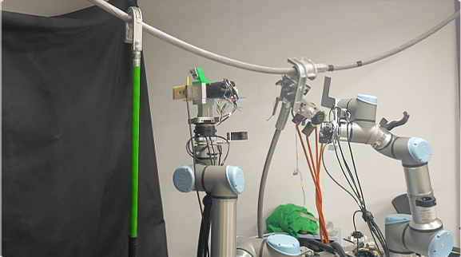
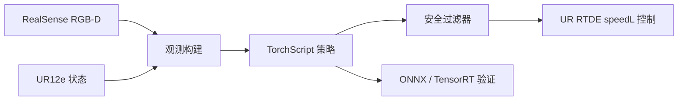

# MP1 Jetson 真机部署项目

**重点展示推理加速和部署加速内容，用表格形式**

**部署流程讲清楚，先用ckpt导出pt测试，在导出onnx，tensorRT加速，这部分用流程图表示**

<div align="center">

</div>

<div align="center">

</div>

## 结论

本项目面向 Jetson 的 MP1 机器人策略真机部署流程。项目将多模态观测处理、TorchScript/LibTorch 推理、Python 与 C++ 数值对齐、RealSense 输入采集、UR12e 控制、安全限幅以及 ONNX/TensorRT 验证工具串成了一条可测试的部署链路。

这个项目的重点不是展示单个模型文件，而是展示如何把学习到的机器人策略可靠地放进真实硬件闭环中：先离线验证，再 dry-run，再接入真实输入，最后才允许受保护的真机执行。

## 项目亮点

- 基于 C++/LibTorch 在 Jetson 上部署学习到的多模态机器人操作策略。
- 接入 RealSense RGB-D 相机和 UR RTDE 机器人状态/控制接口。
- 设计分阶段验证流程：离线对齐、固定输入 dry-run、真实输入 dry-run、受保护真机执行。
- 加入动作限幅、workspace 边界检查、显式执行确认和速度控制等安全机制。
- 提供 ONNX/TensorRT 导出与误差验证工具，用于后续加速实验。

## 系统架构



## 部署流程

```text
离线数值对齐
-> 固定输入 dry-run
-> 真实输入采集
-> 真实输入 dry-run
-> 受保护真机执行
-> 单进程实时闭环
-> ONNX/TensorRT 验证
```

每一步只验证一个层次的问题。shape 正确并不等于语义正确，图像通道顺序、旋转表示、点云坐标系和动作后处理都必须与训练时假设保持一致。

## 目录结构

```text
.
├── cpp_deploy/                  # C++/Jetson 部署代码
│   ├── include/mp1_deploy/       # 推理、安全和硬件接口
│   ├── src/                      # 离线推理、dry-run、真机控制
│   ├── tests/                    # 安全过滤器测试
│   └── configs/                  # 机器人/相机示例配置
├── python_deploy/                # Python 策略和真机工具
├── tools/                        # Python 导出、对齐和验证脚本
│   └── tensorrt/                 # ONNX/TensorRT 离线验证工具
├── README.md                     # 英文项目说明
├── README_zh.md                  # 中文项目说明
└── requirements.txt              # Python 部署依赖
```

## 核心组件

| 组件                               | 作用                                          |
| -------------------------------- | ------------------------------------------- |
| `mp1_offline_infer`              | 加载 TorchScript 模型，用冻结样本和 Python 输出做离线对齐。    |
| `mp1_dry_run`                    | 使用固定输入重复推理，不发送机器人控制命令。                      |
| `capture_real_inputs.py`         | 将 RealSense 和 RTDE 观测采集成模型可消费的张量。           |
| `mp1_real_input_dry_run`         | 读取真实输入并打印过滤后的动作，不控制机器人。                     |
| `mp1_real_robot_control`         | 在显式确认后执行低幅度、受保护的真机控制。                       |
| `mp1_realtime_robot_control`     | 在单个 C++ 进程中完成采集、ring buffer、推理、安全过滤和控制。     |
| `TrtPolicyRuntime`               | TensorRT 8.x C++ 后端，显式启用时执行 ONNX 子图和完整采样循环。 |
| `test_safety_filter`             | 验证平移/旋转限幅和动作过滤逻辑。                           |
| `tools.tensorrt.check_onnx_parity`     | 对比 PyTorch、ONNX Runtime 和 TorchScript 导出结果。 |
| `tools.tensorrt.check_trt_case_parity` | 在不加载完整训练栈的情况下验证冻结的 TensorRT case。           |
| `tools.tensorrt.run_trt_case`          | 使用 TensorRT Python API 生成离线 engine 对齐输出。            |

## 我的贡献

- 搭建 C++/LibTorch 推理链路，将学习到的机器人策略部署到 Jetson。
- 设计从离线对齐到真实输入 dry-run 的分阶段验证流程。
- 实现安全过滤和显式执行确认，降低真机闭环调试风险。
- 整理 ONNX/TensorRT 导出与误差验证工具，为边缘端加速提供证据。
- 将配置、依赖和文档整理为更适合公开展示的 GitHub 仓库结构。

## 安全设计

真机部署路径默认保守：

- 默认不发送机器人命令。
- 真机执行必须同时传入 `--execute 1` 和 `--confirm RUN_ROBOT`。
- dry-run 程序只打印动作，不控制机器人。
- 安全过滤器限制单步平移和旋转幅度。
- workspace 超界时跳过命令，而不是强行把目标夹回边界。
- UR 速度控制参数从部署配置中读取。

## 快速开始

安装 Python 部署依赖：

```bash
pip install -r requirements.txt
```

在 Jetson 或兼容的 Ubuntu + LibTorch 环境中构建 C++ 部署目标：

```bash
cmake -S cpp_deploy -B build \
  -DCMAKE_BUILD_TYPE=Release \
  -DCMAKE_PREFIX_PATH=/path/to/libtorch

cmake --build build -j
ctest --test-dir build --output-on-failure
```

运行离线对齐检查：

```bash
./build/mp1_offline_infer \
  --model deploy_artifacts/policy_infer.pt \
  --tensor-dir deploy_artifacts/sample_tensors \
  --device cpu
```

在任何真机执行前，先运行受保护 dry-run：

```bash
./build/mp1_dry_run \
  --model deploy_artifacts/policy_infer.pt \
  --tensor-dir deploy_artifacts/sample_tensors \
  --device cuda \
  --steps 5 \
  --warmup-steps 3
```

## 配置说明

公开配置文件中的硬件相关字段使用占位符：

```json
{
  "robot": {
    "ip": "ROBOT_IP_PLACEHOLDER"
  },
  "cameras": [
    {
      "serial": "GLOBAL_REALSENSE_SERIAL_PLACEHOLDER"
    },
    {
      "serial": "WRIST_REALSENSE_SERIAL_PLACEHOLDER"
    }
  ]
}
```

真实硬件运行前，请在本地创建私有配置文件。不要提交本地 IP、相机序列号、checkpoint、导出模型、原始机器人数据或部署日志。

## 验证证据

该部署流程关注以下证据：

- Python 与 C++ TorchScript 输出对齐。
- 固定输入 dry-run 稳定性。
- 真实输入张量的 shape、dtype 和时序。
- 过滤后动作的方向和幅度。
- workspace 与速度控制安全行为。
- PyTorch、ONNX Runtime 和 TensorRT 的数值误差。

一次已记录的 CPU 离线对齐结果为：

```text
expected max_abs_diff: 3.57628e-07
```

## 已知限制

- TensorRT 默认作为离线加速验证路径；C++ 后端需在 Jetson 对齐通过后显式启用。
- 真机运行依赖本地 UR12e、RealSense 和 Jetson 环境。
- checkpoint、TorchScript、ONNX、TensorRT engine、原始数据和部署日志不会进入 Git，需要通过 release 或外部 artifact 存储单独分发。

## 求职视角

这个项目适合展示三类能力：

- 机器人系统工程：真实硬件输入、推理、控制和安全边界。
- 部署工程：Python 训练侧到 C++/Jetson 推理侧的行为对齐。
- 工程可靠性：分阶段验证、显式确认、可复现配置和可审计文档。
