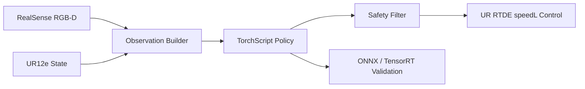

# MP1 Jetson Real-Robot Deployment

## Conclusion

This repository demonstrates a real-robot deployment pipeline for an MP1 manipulation policy on Jetson. It connects multimodal observation processing, TorchScript/LibTorch inference, Python-to-C++ parity checks, RealSense input capture, UR12e control, safety filtering, and ONNX/TensorRT validation tools.

The project goal is practical deployment: make a learned policy run through a staged, testable path before any robot command is allowed.

## Highlights

- Deploys a learned multimodal manipulation policy with C++/LibTorch on Jetson.
- Uses RealSense RGB-D cameras and UR RTDE state/control interfaces.
- Provides staged validation from offline parity to real-input dry-run to guarded robot execution.
- Includes safety checks for action limits, workspace boundaries, execution confirmation, and speed control.
- Provides ONNX/TensorRT export and parity tooling for acceleration experiments.

## System Architecture



## Deployment Flow

```text
Offline parity check
-> Fixed-input dry-run
-> Real-input capture
-> Real-input dry-run
-> Guarded real-robot execution
-> Realtime single-process loop
-> ONNX/TensorRT validation
```

Each stage is designed to verify one layer of the system before moving to the next one. Shape checks alone are not enough: image channel order, rotation representation, point-cloud frame, and action post-processing must all match the policy's training-time assumptions.

## Repository Layout

```text
.
├── cpp_deploy/                  # C++/Jetson deployment code
│   ├── include/mp1_deploy/       # Runtime and safety interfaces
│   ├── src/                      # Offline inference, dry-run, robot control
│   ├── tests/                    # Safety-filter tests
│   └── configs/                  # Example robot/camera configuration
├── python_deploy/                # Python policy and real-robot utilities
├── tools/                        # Export, parity, and TensorRT helper scripts
├── README.md                     # Project overview
└── requirements.txt              # Python deployment dependencies
```

## Key Components

| Component | Purpose |
| --- | --- |
| `mp1_offline_infer` | Runs TorchScript inference on frozen sample tensors and compares against Python outputs. |
| `mp1_dry_run` | Repeats inference on fixed inputs without sending robot commands. |
| `capture_real_inputs.py` | Captures RealSense and RTDE observations into model-ready tensors. |
| `mp1_real_input_dry_run` | Runs inference on captured real inputs and prints filtered actions only. |
| `mp1_real_robot_control` | Executes guarded, low-amplitude robot control after explicit confirmation. |
| `mp1_realtime_robot_control` | Runs capture, ring buffer, inference, safety filtering, and control in one C++ process. |
| `test_safety_filter` | Verifies translation/rotation limits and action filtering behavior. |
| `tools/check_onnx_parity.py` | Compares PyTorch, ONNX Runtime, and exported TorchScript behavior. |
| `tools/check_trt_case_parity.py` | Validates frozen TensorRT cases without loading the full training stack. |

## Safety Design

The real-robot path is intentionally conservative:

- Robot execution is disabled by default.
- Real execution requires both `--execute 1` and `--confirm RUN_ROBOT`.
- Dry-run programs only print actions and never send robot commands.
- The safety filter limits translation and rotation per step.
- Workspace violations skip commands instead of forcing targets back into range.
- UR speed control parameters are read from the deployment config.

## Quick Start

Install the Python deployment dependencies:

```bash
pip install -r requirements.txt
```

Build the C++ deployment targets on Jetson or a compatible Ubuntu environment with LibTorch:

```bash
cmake -S cpp_deploy -B build \
  -DCMAKE_BUILD_TYPE=Release \
  -DCMAKE_PREFIX_PATH=/path/to/libtorch

cmake --build build -j
ctest --test-dir build --output-on-failure
```

Run an offline parity check:

```bash
./build/mp1_offline_infer \
  --model deploy_artifacts/policy_infer.pt \
  --tensor-dir deploy_artifacts/sample_tensors \
  --device cpu
```

Run a guarded dry-run before any robot execution:

```bash
./build/mp1_dry_run \
  --model deploy_artifacts/policy_infer.pt \
  --tensor-dir deploy_artifacts/sample_tensors \
  --device cuda \
  --steps 5 \
  --warmup-steps 3
```

## Configuration

Hardware-specific values are represented with placeholders in the public config files:

```json
{
  "robot": {
    "ip": "ROBOT_IP_PLACEHOLDER"
  },
  "cameras": [
    {
      "serial": "GLOBAL_REALSENSE_SERIAL_PLACEHOLDER"
    },
    {
      "serial": "WRIST_REALSENSE_SERIAL_PLACEHOLDER"
    }
  ]
}
```

Create a private local config before running on real hardware. Do not commit local IP addresses, camera serial numbers, checkpoints, exported models, raw robot data, or deployment logs.

## Validation Evidence

The deployment workflow tracks these evidence points:

- Python vs C++ TorchScript output parity.
- Fixed-input dry-run stability.
- Real-input tensor shape, dtype, and timing.
- Filtered action direction and magnitude.
- Workspace and speed-control safety behavior.
- PyTorch vs ONNX Runtime vs TensorRT numerical differences.

One recorded CPU parity check reached:

```text
expected max_abs_diff: 3.57628e-07
```

## Notes

Large artifacts such as checkpoints, TorchScript exports, ONNX models, TensorRT engines, raw datasets, and deployment logs are intentionally ignored by Git. Publish them through releases or external artifact storage when needed.
