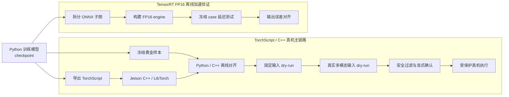
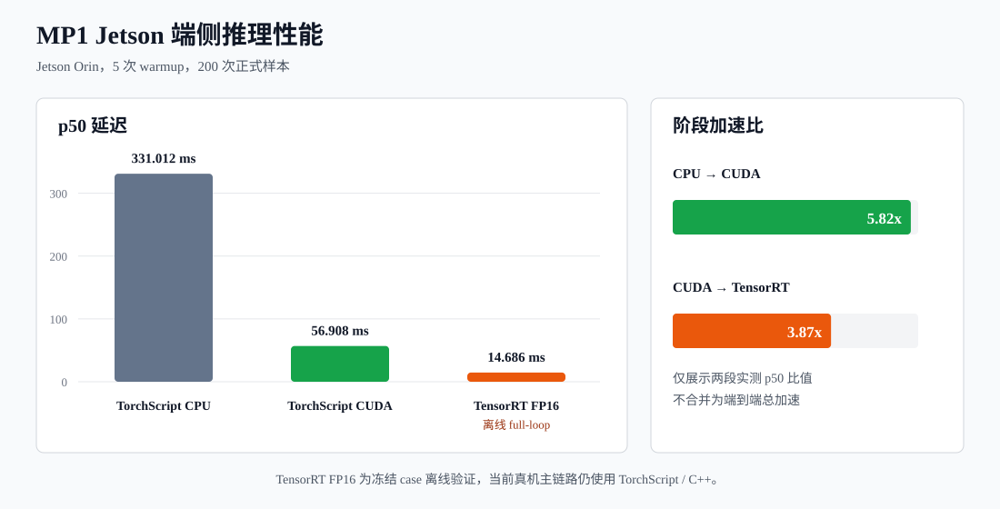

# MP1 机器人策略：Jetson C++ 端侧部署与推理加速

本项目面向变电站带电拆接引流线场景，探索机械臂在非结构化环境中自动取等电位杆任务。项目基于训练完成的 MP1 多模态机器人策略，构建从 Python 模型到 Jetson AGX Orin C++ 推理、真实观测接入和受保护机器人执行的部署链路。

我负责训练前专家数据采集与多模态数据清洗，以及 Python 推理链路向 Jetson C++/LibTorch 的迁移；完成 TorchScript 导出与加载、黄金样本离线对齐、CUDA 推理优化、ONNX/TensorRT FP16 离线验证和真机执行前的安全验证。

## 端侧部署流程



主链路按“先离线、再 dry-run、最后受保护执行”的顺序逐级验证。TensorRT 分支只消费冻结的 ONNX、engine 和测试 case，不连接机器人控制入口。

## 推理加速结果

<div align="center">

</div>

| 推理路径                                | 状态        | 样本数 | p50 (ms) | p95 (ms) | p99 (ms) | mean (ms) |           阶段加速 |
| ----------------------------------- | --------- | --: | -------: | -------: | -------: | --------: | -------------: |
| TorchScript CPU fixed-input         | Jetson 实测 | 200 |  331.012 |  409.941 |  422.202 |   331.678 |             基线 |
| TorchScript CUDA fixed-input        | Jetson 实测 | 200 |   56.908 |   62.730 |   64.233 |    57.344 |  较 CPU `5.82x` |
| TensorRT FP16 frozen case full-loop | 离线验证      | 200 |   14.686 |   19.255 |   21.261 |    15.260 | 较 CUDA `3.87x` |

Benchmark 口径：

- TorchScript 统计 `TorchScriptRuntime::infer()` 全段，包含输入搬运到运行设备、模型 forward 和输出回 CPU，不包含真实输入加载与 `SafetyFilter`。
- TensorRT FP16 基于冻结 case，包含输入读取、Host/Device 拷贝、engine 执行、完整采样循环、输出回 CPU 和动作反归一化。

完整实验环境、原始统计和局限说明见 [Jetson Benchmark 报告](./JETSON_BENCHMARK_REPORT.md)。图表可通过以下命令重新生成：

```bash
python tools/generate_inference_benchmark_chart.py
```

## 核心工程实现

| 模块            | 实现内容                                                                                     | 关键证据                                                                                                              |
| ------------- | ---------------------------------------------------------------------------------------- | ----------------------------------------------------------------------------------------------------------------- |
| C++ 端侧推理      | 使用 LibTorch 加载 TorchScript 策略，统一 CPU/CUDA device、输入搬运和动作输出                               | [`torchscript_runtime.cpp`](./cpp_deploy/src/torchscript_runtime.cpp)                                             |
| 多模态输入链路       | 将双相机 RGB、点云、TCP 位姿和夹爪状态转换为模型输入张量；图像完成 resize 与 HWC→CHW，点云完成工作空间裁剪和固定点数下采样                | [`capture_real_inputs.py`](./cpp_deploy/tools/capture_real_inputs.py)                                             |
| 部署一致性验证       | 冻结 Python 黄金样本，在 C++ 离线推理中校验输入 shape、dtype 和策略输出；已记录 `expected max_abs_diff=3.57628e-07` | [`offline_infer.cpp`](./cpp_deploy/src/offline_infer.cpp)                                                         |
| 真实输入与 dry-run | 支持固定输入、已采集真实帧和实时观测的分阶段推理验证，不默认发送机器人命令                                                    | [`dry_run.cpp`](./cpp_deploy/src/dry_run.cpp)、[`real_input_dry_run.cpp`](./cpp_deploy/src/real_input_dry_run.cpp) |
| 安全过滤          | 对模型动作执行平移/旋转限幅、workspace 检查和夹爪屏蔽，真机执行需要显式参数与确认字符串                                        | [`safety_filter.cpp`](./cpp_deploy/src/safety_filter.cpp)                                                         |
| TensorRT 离线验证 | 将观测编码器和 U-Net step 拆分为 ONNX 子图，构建 FP16 engine，并验证完整采样循环的延迟与输出误差                          | [`tools/tensorrt`](./tools/tensorrt/)                                                                             |

多模态输入契约如下：

| 输入              | Shape / dtype               | 处理                          |
| --------------- | --------------------------- | --------------------------- |
| `global_image`  | `[1, 2, 3, 128, 128] uint8` | RGB resize、HWC→CHW、两帧堆叠     |
| `wrist_image`   | `[1, 2, 3, 96, 96] uint8`   | RGB resize、HWC→CHW、两帧堆叠     |
| `point_cloud`   | `[1, 2, 512, 3] float32`    | 工作空间裁剪、固定 512 点下采样          |
| `agent_pos`     | `[1, 2, 10] float32`        | TCP xyz、rotvec→rot6d、夹爪状态拼接 |
| `initial_noise` | `[1, 4, 7] float32`         | 冻结输入用于可复现对齐                 |

## 应用场景与演示

实验场景：

<div align="center">

</div>

机械臂取杆过程：

<div align="center">

</div>

## 快速开始

安装 Python 工具依赖：

```bash
pip install -r requirements.txt
```

在 Jetson 或兼容的 Ubuntu + LibTorch 环境中构建 C++ 部署目标：

```bash
cmake -S cpp_deploy -B build \
  -DCMAKE_BUILD_TYPE=Release \
  -DCMAKE_PREFIX_PATH=/path/to/libtorch \
  -DMP1_ENABLE_UR_RTDE=OFF

cmake --build build -j
ctest --test-dir build --output-on-failure
```

运行离线对齐：

```bash
./build/mp1_offline_infer \
  --model deploy_artifacts/policy_infer.pt \
  --tensor-dir deploy_artifacts/sample_tensors \
  --device cpu
```

运行 CUDA fixed-input dry-run：

```bash
./build/mp1_dry_run \
  --model deploy_artifacts/policy_infer.pt \
  --tensor-dir deploy_artifacts/sample_tensors \
  --device cuda \
  --steps 200 \
  --warmup-steps 5
```

真实输入采集、TensorRT 构建和真机控制步骤见 [C++/Jetson 部署手册](./cpp_deploy/README.md)。

## 文档导航

| 文档                                                  | 内容                                     |
| --------------------------------------------------- | -------------------------------------- |
| [C++/Jetson 部署手册](./cpp_deploy/README_CN.md)        | 构建、离线对齐、真实输入、dry-run、真机控制和 TensorRT 后端 |
| [Jetson Benchmark 报告](./JETSON_BENCHMARK_REPORT.md) | 实验环境、延迟分位数、显存口径、安全过滤统计                 |
| [部署工具说明](./tools/README.md)                         | 模型导出、Python 行为冻结和验证工具                  |

## 安全边界与已知限制

- 所有机器人入口默认不发送控制命令；真机执行必须同时传入 `--execute 1` 和 `--confirm RUN_ROBOT`。
- 模型输出在进入机器人前经过平移/旋转限幅、workspace 检查。
- TensorRT FP16 当前仅完成离线 frozen case 的延迟与误差验证，真机主链路仍使用 TorchScript/C++。
- 真机运行依赖本地 UR12e、RealSense 和 Jetson 环境。公开配置使用占位符，不提交设备 IP、相机序列号、checkpoint、导出模型、原始数据或部署日志。
- checkpoint、TorchScript、ONNX 和 TensorRT engine 需要通过 release 或外部 artifact 存储单独分发。

